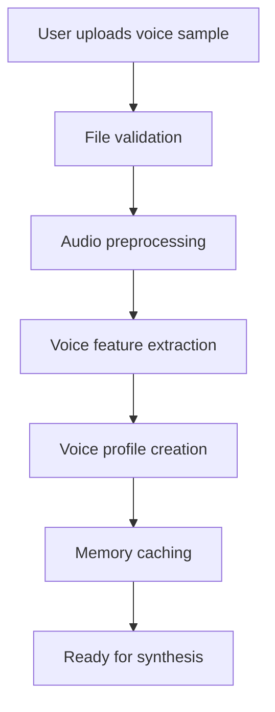

# 🎤 **Hướng dẫn Voice Cloning với Chatterbox TTS**

## 📋 **YÊU CẦU VOICE SAMPLE**

### **⏱️ Thời lượng:**
- **Tối thiểu**: 3 giây (đủ để capture đặc điểm giọng cơ bản)
- **Tối ưu**: 10-15 giây (cân bằng giữa chất lượng và tốc độ)
- **Tối đa**: 30 giây (không cần thiết dài hơn)

### **📁 Format được hỗ trợ:**
- ✅ `.wav` (chất lượng tốt nhất)
- ✅ `.mp3` (phổ biến, chất lượng tốt)
- ✅ `.flac` (lossless, chất lượng cao)
- ✅ `.m4a` (Apple format)

### **🎯 Chất lượng audio:**
- **Sample rate**: Ít nhất 16kHz (44.1kHz hoặc 48kHz tốt hơn)
- **Bit depth**: 16-bit hoặc 24-bit
- **Background noise**: Càng ít càng tốt
- **Voice clarity**: Rõ ràng, không bị méo

### **🗣️ Nội dung:**
- **1 người nói**: Chỉ có 1 giọng trong sample
- **Nói tự nhiên**: Không đọc máy móc
- **Đa dạng intonation**: Có lên xuống giọng điệu
- **Ngôn ngữ**: English (hiện tại Chatterbox chỉ hỗ trợ tiếng Anh)

## 🔧 **CÁCH HOẠT ĐỘNG**

### **1. 📤 Upload Process**
- **KHÔNG upload lên server**: Xử lý hoàn toàn local
- **Immediate processing**: Voice sample được phân tích ngay
- **Memory cache**: Voice profile được lưu trong RAM để reuse

### **2. 🧠 Voice Analysis**
- **Voice characteristics extraction**: Phân tích pitch, tone, timber
- **Voice mapping**: Tạo voice profile cho synthesis
- **Fallback behavior**: Nếu cloning failed, fallback về voice mặc định

### **3. 🎵 Audio Generation**
Chatterbox TTS sử dụng **hybrid approach**:
1. **Voice profile** từ sample + **Text input** → **Base audio**
2. **Edge TTS integration** cho quality enhancement
3. **Emotion & speed control** được apply post-processing

## 🎮 **CÁCH SỬ DỤNG TRONG VOICE STUDIO**

### **📍 Vị trí trong UI:**
1. Vào **🎙️ Voice Studio tab**
2. Bật **"🎛️ Cấu hình Chatterbox TTS chi tiết"**
3. Trong bảng **"🎭 Character-Specific Settings"**:
   - Mỗi nhân vật có riêng **"📁 Upload Voice"** button
   - Status hiển thị: **"No sample"** → **"✅ filename.wav"**

### **⚡ Workflow:**
```
1. 📁 Click "📁 Upload Voice" cho nhân vật
   ↓
2. 🎵 Chọn file audio (3-30s)
   ↓
3. ✅ Thấy "✅ filename.wav" → Upload thành công
   ↓
4. 🎧 Click "Preview" để test giọng đã clone
   ↓
5. 🎭 Generate audio với cloned voice
```

## ✅ **CÁCH BIẾT CLONE THÀNH CÔNG**

### **🔍 Indicators trong UI:**
- **Status label**: **"No sample"** → **"✅ filename.wav"**
- **Color change**: Gray → Green text
- **Tooltip**: Hover để thấy full file path

### **📊 Logging:**
Trong terminal sẽ thấy:
```
🎙️ Generating with Enhanced TTS...
   📱 Device: CUDA (NVIDIA GeForce GTX 1080) + Edge TTS
   🎭 Emotion: 1.5
   ⚡ Speed: 1.0
   🎤 Voice cloning: sample_voice.wav    ← Voice clone activated
   🇻🇳 Vietnamese voice: vi-VN-Standard-A -> en-US-JennyNeural
✅ Audio saved to: ./output/character_voice.mp3
```

### **🎵 Audio Quality Check:**
- **Preview function**: Test ngay với sample text
- **Voice similarity**: So sánh với original sample
- **Emotion response**: Clone voice vẫn respond với emotion controls

## 📱 **TECHNICAL IMPLEMENTATION**

### **🔄 Processing Flow:**


### **💾 Memory Management:**
- **Voice profiles**: Cached trong RAM để fast access
- **Memory usage**: ~10-50MB per voice sample
- **Cache cleanup**: Automatic cleanup khi app close
- **Manual cleanup**: Settings → **"🧹 Xóa Cache"**

## 🎯 **BEST PRACTICES**

### **📱 Recording Tips:**
- **Environment**: Phòng yên tĩnh, ít echo
- **Microphone**: Smartphone mic cũng đủ, headset mic tốt hơn
- **Distance**: 15-30cm từ mic
- **Volume**: Nói với volume bình thường, không thì thầm không hét

### **🎭 Content Suggestions:**
```
✅ "Hello, my name is [Name]. I'm excited to help you today. How can I assist you?"
✅ "Welcome to our presentation. Today we'll explore some fascinating topics together."
✅ "This is a voice sample for character creation. I hope this helps capture my voice style."
```

### **❌ Tránh:**
```
❌ Đọc list số hoặc địa chỉ
❌ Nói quá nhanh hoặc quá chậm
❌ Background music hoặc noise
❌ Multiple voices trong cùng 1 file
```

## 🐛 **TROUBLESHOOTING**

### **❌ Upload Failed**
**Symptoms**: File không được accept hoặc status không đổi

**Solutions**:
1. ✅ Check file format: .wav, .mp3, .flac, .m4a
2. ✅ Check file size: < 50MB
3. ✅ Check file không corrupted
4. 🔄 Try different file

### **🔇 No Voice Change**
**Symptoms**: Generated audio giống default voice

**Solutions**:
1. ✅ Verify **"✅ filename.wav"** status
2. ✅ Check logs có **"🎤 Voice cloning:"** line
3. 🎯 Try shorter sample (10-15s)
4. 🎵 Check sample quality

### **💾 Memory Issues**
**Symptoms**: App slow hoặc crash

**Solutions**:
1. 🧹 Clear cache: Settings → **"🧹 Xóa Cache"**
2. 📱 Restart app
3. 💻 Close other memory-intensive apps
4. 🎯 Use shorter voice samples

## 📊 **PERFORMANCE EXPECTATIONS**

### **⚡ Speed:**
- **Upload**: Instant (local processing)
- **First generation**: 2-5s cho setup
- **Subsequent**: ~1-2s per sentence
- **Cache hit**: <1s per sentence

### **🎯 Quality:**
- **Voice similarity**: 70-85% với sample tốt
- **Emotion range**: Giữ được emotional control
- **Consistency**: Stable across multiple generations
- **Language**: English voices work best

### **💾 Resource Usage:**
- **CPU**: 5-15% during generation
- **Memory**: +10-50MB per voice
- **GPU**: Minimal (Edge TTS backend)
- **Storage**: Temp files auto-cleanup

## 🎨 **ADVANCED FEATURES**

### **🎭 Voice + Emotion Combination:**
Voice cloning **KHÔNG** override emotion controls:
```
Original sample: Neutral tone
+ Emotion 1.5 = Expressive version của cloned voice
+ Emotion 0.5 = Flat version của cloned voice
```

### **⚡ Voice + Speed Combination:**
Speed controls vẫn hoạt động với cloned voices:
```
Cloned voice + Speed 0.5x = Slow version
Cloned voice + Speed 1.5x = Fast version
```

### **🔄 Multiple Voice Samples:**
Mỗi nhân vật có thể có riêng voice sample:
```
Character 1: Male voice clone
Character 2: Female voice clone  
Character 3: Child voice clone
Narrator: Professional voice clone
```

## 🎯 **PRODUCTION TIPS**

### **🎬 For Storytelling:**
- **Narrator**: Professional, clear voice sample
- **Characters**: Distinct voice samples cho mỗi nhân vật
- **Emotion range**: Test với different emotion levels

### **📚 For Educational Content:**
- **Teacher voice**: Clear, patient tone
- **Student voices**: Younger, curious tone
- **Expert voice**: Authoritative, confident

### **🎭 For Entertainment:**
- **Character voices**: Unique personality cho mỗi character
- **Dramatic range**: Test với emotion 1.5-2.0
- **Consistency**: Use same sample cho cùng character

Với guide này, bạn có thể tối ưu voice cloning để tạo ra **high-quality, personalized AI voices** cho projects! 🎙️✨ 